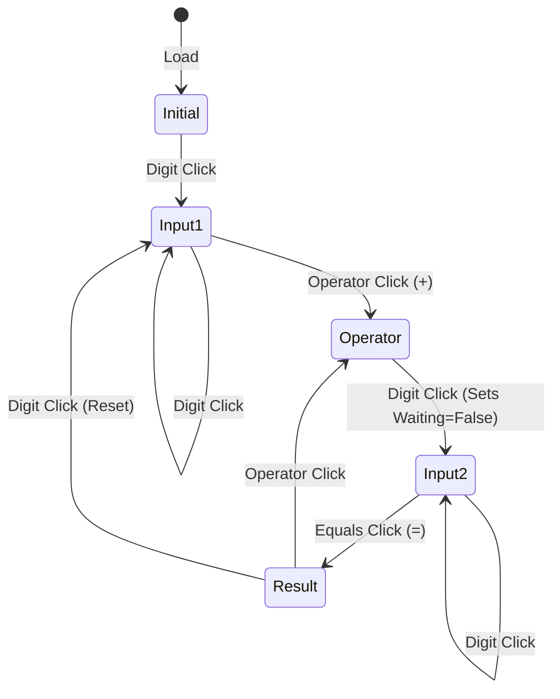

# Calculator - Project Documentation

## 1. Project Overview
A robust arithmetic calculator built with a focus on logic separation and state management. Unlike simple DOM-parsing calculators, this project maintains an internal source of truth (`calculator` object) to ensure precision and handle edge cases like chained operations.

## 2. State Machine Diagram
This flowchart depicts how the calculator transitions between states based on user input, ensuring the "Waiting for Second Operand" logic functions correctly.

## 3. Event Delegation Map
To optimize performance, a single event listener is attached to the parent container `.calculator-buttons` instead of adding listeners to every button.

| Target Class | Function Triggered | Logic Description |
| :--- | :--- | :--- |
| `.number` | `handleNumber(value)` | Appends digit or overwrites if `waitingForSecondOperand` is true. |
| `.operator` | `handleOperator(value)` | Stores current operator and invokes `performCalculation` if chaining. |
| `.all-clear` | `resetCalculator()` | Resets state object to initial values (`0`, `null`, `false`). |
| `.decimal` | `inputDecimal(dot)` | Appends `.` only if one doesn't already exist. |

## 4. Key Files
*   `script.js`: Contains the `calculator` state object and `performCalculation` lookup table.
*   `styles.css`: Grid layout for the calculator buttons.
