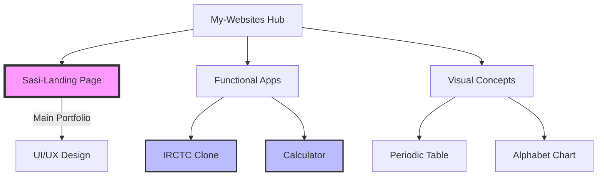

# My-Websites - Portfolio Architectural Overview

## 1. Executive Summary
This workspace is a collection of 5 distinct web applications, each demonstrating specific core competencies in frontend engineering—from complex state management and algorithm design to advanced CSS Grid layouts and scroll-based animations.

## 2. Visual Site Map
The following diagram illustrates the relationship between the central landing page and the specialized sub-projects.

## 3. Project Ecosystem Table

| Project Name | Primary Tech Stack | Key Architectural Feature | Documentation |
| :--- | :--- | :--- | :--- |
| **Sasi-Landing Page** | GSAP, AOS, CSS Flexbox | Scroll-triggered animations & responsive nav | [View Docs](file:///d:/Projects/My-Websites/Sasi-Landing%20Page/README.md) |
| **IRCTC Clone** | Vanilla JS, DOM Manipulation | Dynamic Content Injection (SPA logic) | [View Docs](file:///d:/Projects/My-Websites/irctc/README.md) |
| **Calculator** | JS Objects, Event Delegation | Centralized State Management | [View Docs](file:///d:/Projects/My-Websites/Calculator/README.md) |
| **Periodic Table** | CSS Grid (18 columns) | Complex Data Visualization Layout | [View Docs](file:///d:/Projects/My-Websites/periodic%20table/README.md) |
| **Alphabet Chart** | DOM Events | Interactive Media Toggling | [View Docs](file:///d:/Projects/My-Websites/alphabet%20chart/README.md) |

## 4. Navigation Guide
Use the "View Docs" links in the table above to navigate to the detailed documentation for each specific project. Each sub-project's README contains:
*   **Flowcharts:** Explaining user journeys and logic.
*   **Tables:** Detailing specific event handlers and state transitions.
*   **Tech Breakdowns:** Explaining the "Why" behind the code.
