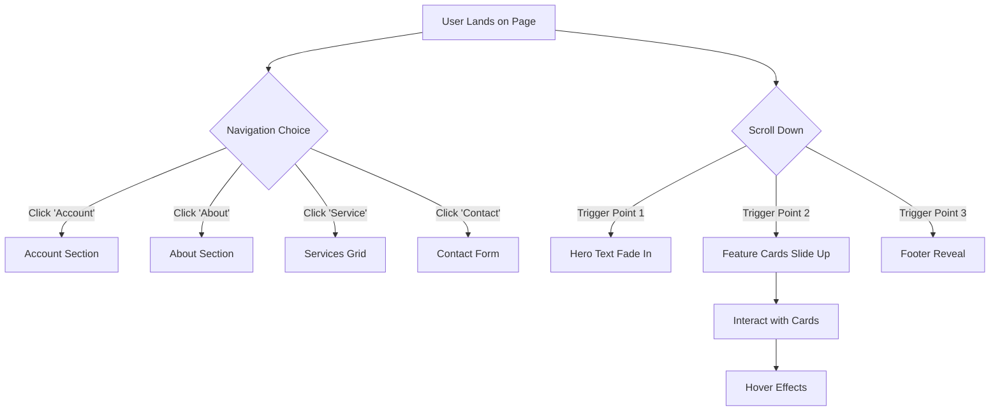

# Sasi-Landing Page - Project Documentation

## 1. Project Overview
This is the central hub of the portfolio, designed as a high-impact travel agency landing page. It serves as the visual anchor for the workspace, demonstrating responsive design and scroll-triggered animations.

## 2. User Journey Flowchart
This diagram illustrates the user's path through the landing page navigation and interactions.

## 3. Animation Triggers & Libraries
The project heavily relies on GSAP and AOS for visual storytelling.

| Library | Purpose | Key Trigger / Effect |
| :--- | :--- | :--- |
| **AOS (Animate On Scroll)** | Scroll-based element reveals | `data-aos="fade-up"` on Service Cards |
| **GSAP (GreenSock)** | Complex, timeline-based animations | Hero Section text staggering |
| **Vanilla CSS** | Micro-interactions | Button hover states, Navbar toggling |

## 4. Key Files
*   `index.html`: Structure and AOS data attributes.
*   `style.css`: Responsive Grid layouts and custom animations.
*   `script.js`: Mobile menu toggle logic.
