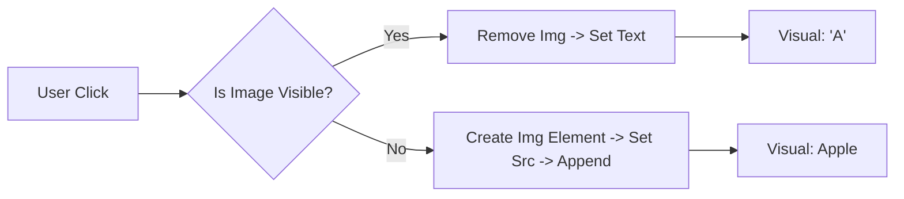

# Alphabet Chart - Project Documentation

## 1. Project Overview
An interactive educational tool for children. Clicking on any letter in the table toggles between showing the text character (e.g., "A") and a corresponding image (Apple), making it an engaging learning experience.

## 2. Interaction Flowchart
The logic handles the state of each cell (showing text vs. showing image) dynamically.

## 3. Data Structure
The project uses a simple JavaScript object to map letters to image URLs.

| Letter | Data Attribute | Image Source |
| :--- | :--- | :--- |
| **A** | `data-letter="A"` | `download.jpg` (Apple) |
| **B** | `data-letter="B"` | `download.jpg` (Ball) |
| **C** | `data-letter="C"` | `download.jpg` (Cat) |

## 4. Key Files
*   `index.html`: Contains both the table structure and the embedded `<script>` tag logic.
