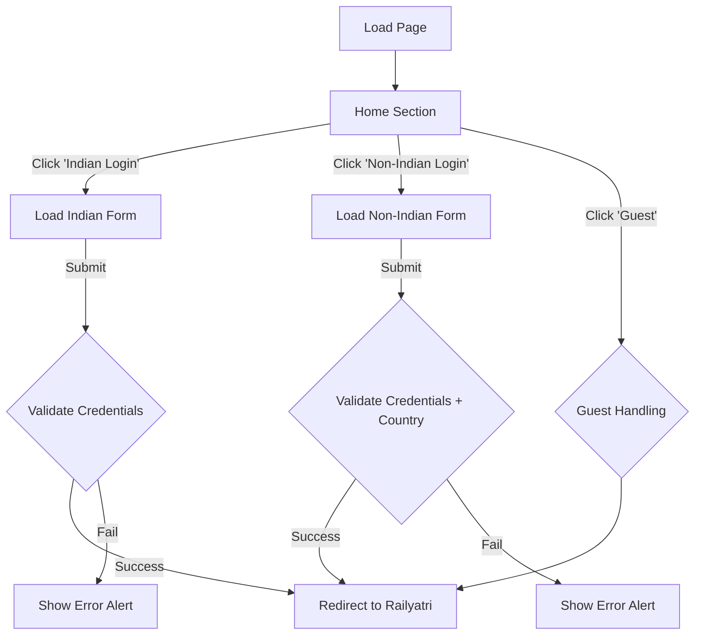

# IRCTC Clone - Project Documentation

## 1. Project Overview
A functional simulation of the Indian Railways booking portal. This project demonstrates advanced DOM manipulation by using a single-page architecture where content is dynamically swapped based on user role selection, mimicking a modern SPA framework using vanilla JavaScript.

## 2. Authentication Logic Flowchart
This diagram details the complex conditional logic used to handle different user types (Indian, Non-Indian, Guest).

## 3. Dynamic Section Loaders
The application uses a `loadSection(sectionName)` function to inject HTML strings.

| Section ID | User Action | Content Loaded |
| :--- | :--- | :--- |
| `home` | Initial Load | Main dashboard links with background image. |
| `indian` | Click "Indian Login" | Username/Password form validation logic. |
| `non-indian` | Click "Non-Indian Login" | Username/Password + **Country** field validation. |
| `indian-signup` | Click "Sign Up" (Indian) | Registration form with Email validation. |

## 4. Key Files
*   `irctc.js`: Contains the core `validateLogin` and `loadSection` functions.
*   `irctc.css`: Styles for the forms and background images.
