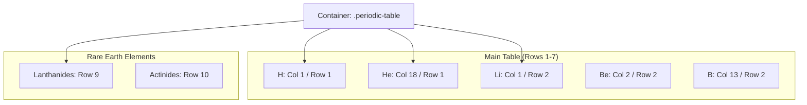

# Periodic Table - Project Documentation

## 1. Project Overview
A visually accurate digital representation of the Periodic Table of Elements. This project serves as a masterclass in CSS Grid, utilizing an 18-column layout to place every element in its precise scientific group and period without using absolute positioning.

## 2. Grid Layout Visualization
The CSS Grid handles the entire structure. Each element is placed using specific column/row coordinates.

## 3. Element Categories & Styling
Classes are used to color-code elements by their chemical properties.

| Class Name | Color Group | Hex Code |
| :--- | :--- | :--- |
| `.alkali-metal` | Alkali Metals | `#ffbebe` |
| `.noble-gas` | Noble Gases | `#bde5ff` |
| `.halogen` | Halogens | `#ffd2b3` |
| `.transition-metal` | Transition Metals | `#ffcccc` |

## 4. Key Files
*   `index.html`: Contains the logic-less DOM structure with 118 element divs.
*   `styles.css`: 300+ lines of CSS defining the precise grid coordinates for every element.
